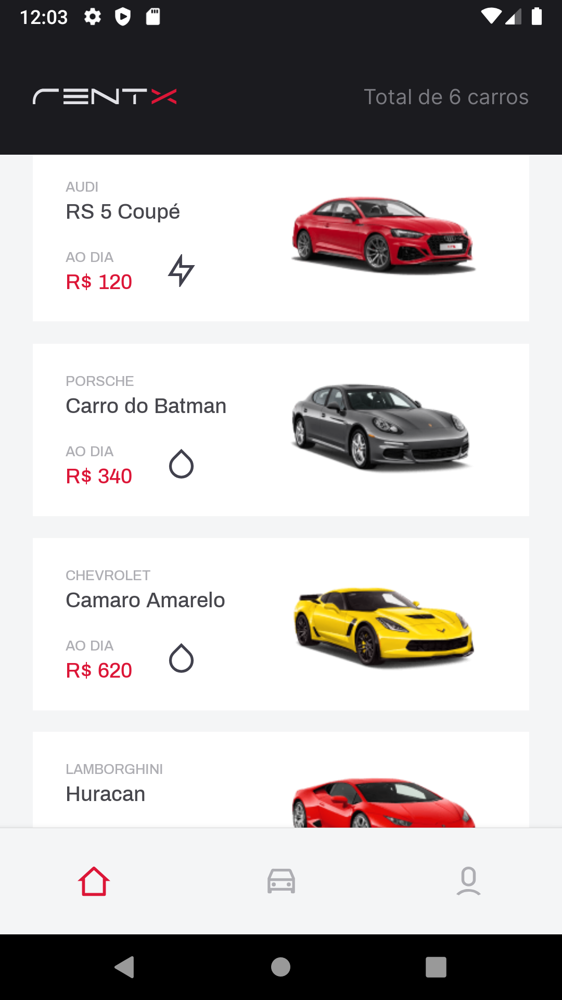
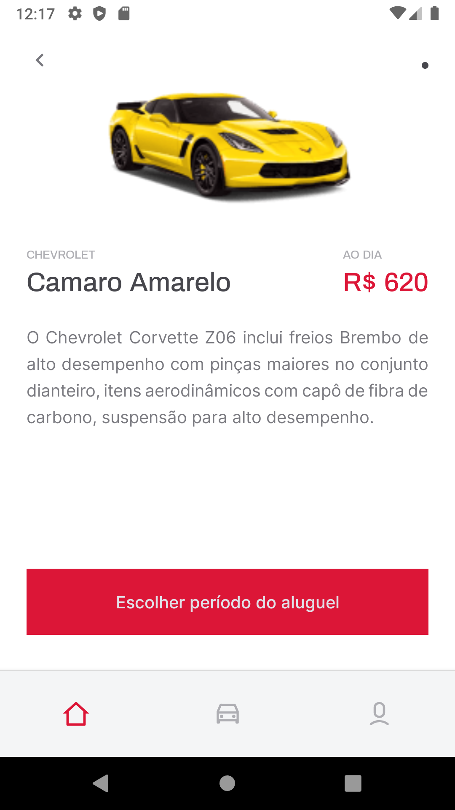

<h1 align="center">
  <br />
</h1>

<h1 align="center" >
  

  
</h1>

<h5 align="center">
  rentx - An app for users that want rent cars from a company.  
</h5>

<p align="center">
  

  <a href="https://www.linkedin.com/in/luishng/">
    
  </a>

  

  <a href="https://github.com/luishng/rentx/commits/main">
    
  </a>

  <a href="https://github.com/luishng/rentx/issues">
    
  </a>

  
</p>

# :pushpin: Table of Contents

<p align="center">
  <a href="#recycle-about-the-project">About the project</a>&nbsp;&nbsp;&nbsp;|&nbsp;&nbsp;&nbsp;
  <a href="#-technologies">Technologies</a>&nbsp;&nbsp;&nbsp;|&nbsp;&nbsp;&nbsp;
  <a href="#-getting-started">Getting Started</a>&nbsp;&nbsp;&nbsp;|&nbsp;&nbsp;&nbsp;
  <a href="#-features">Features</a>&nbsp;&nbsp;&nbsp;|&nbsp;&nbsp;&nbsp;
  <a href="#-license">License</a>
</p>

## :recycle: About the project

This project was developed on the Ignite by [Rocketseat](https://rocketseat.com.br/) &nbsp;🚀

This software a mobile hybrid application, provide a company rent your cars for people.

## 🚀 Technologies

**Language:**
- [TypeScript](https://www.typescriptlang.org/)

**Mobile:**
- [React Native](https://reactnative.dev/)
- [Expo](https://docs.expo.io/) (in Bare Workflow)

**Backend:**
- [NodeJS](https://nodejs.org/)

## 🔗 Features
- Offline First
- List company cars
- Rent cars
- User profile
- Cars rented by the user
- Some animations

## 🏁 Getting Started

**Install the requirements**

- [Git](https://git-scm.com/)
- [Node.js](https://nodejs.org/en/)
- [Yarn](https://classic.yarnpkg.com/) or [npm](https://www.npmjs.com/)
- [React Native](https://reactnative.dev/)
- [Expo](https://docs.expo.io/)

**Clone the project and access the folder**

```bash
$ git clone https://github.com/luishng/rentx.git && cd ignews
```

### Backend

```bash
# Go to rentx-api folder
# Install the dependencies
$ yarn

# Find your local IP with
$ ipconfig(windows) or ifconfig(linux)

# Start the client
$ yarn start

#Now the port to access the api is :3333
```

### Mobile

```bash
# Install the dependencies
$ yarn

# Open file in src/services/api 
# Change the IP to your PC local IP
http://'192.168.1.x':3333

# Start the app
$ npx react-native run-android
```

## 📝 License

This project is licensed under the MIT License - see the [LICENSE](LICENSE) file for details.

---

Made with 💜&nbsp; by [Luis Henrique](https://github.com/luishng) 👋 &nbsp;[See my linkedin](https://www.linkedin.com/in/luishng/) 👷
